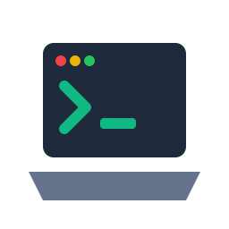

# DevTray

A lightweight, powerful Linux system tray application for developers to manage background services (e.g., Node dev servers, Docker containers, database instances).



Run long-running background tasks without keeping terminal windows open. Group tasks by project, reorder them with intuitive drag-and-drop, view live streaming logs, and start/stop services instantly from the system tray. Processes are terminated cleanly via process group PGID management, preventing detached child processes or lingering ports.

## Installation

### Option 1: AppImage (Recommended)

Download the latest `DevTray-*-x86_64.AppImage` from the [Releases](https://github.com/wdsfgd/devtray/releases) page:

```bash
chmod +x DevTray-*.AppImage
./DevTray-*.AppImage
```

### Option 2: Pre-compiled Binary

Download `devtray-*-x86_64-unknown-linux-gnu` from [Releases](https://github.com/wdsfgd/devtray/releases):

```bash
chmod +x devtray-*
./devtray-*
```

Ensure your system has Qt6 libraries installed (e.g. `qt6-base`, `qt6-declarative`).

---

## Building from Source

### Prerequisites

- **Rust toolchain** (1.80+)
- **Qt6 development libraries** (`qt6-base-dev`, `qt6-declarative-dev`, `qml6-module-qtquick`, `qml6-module-qtquick-controls`, `qml6-module-qt-labs-platform`)
- **CMake & Ninja / build-essential**

#### Ubuntu / Debian (22.04 / 24.04)

```bash
sudo apt update
sudo apt install -y build-essential cmake ninja-build pkg-config \
  qt6-base-dev qt6-declarative-dev qt6-tools-dev \
  qml6-module-qtquick qml6-module-qtquick-controls qml6-module-qtquick-layouts \
  qml6-module-qt-labs-platform libgl1-mesa-dev libxkbcommon-dev
```

#### Fedora

```bash
sudo dnf install -y gcc-c++ cmake ninja-build \
  qt6-qtbase-devel qt6-qtdeclarative-devel qt6-qttools-devel \
  qt6-qtquickcontrols2-devel libxkbcommon-devel mesa-libGL-devel
```

### Build

```bash
git clone https://github.com/wdsfgd/devtray.git
cd devtray
cargo build --release
```

The optimized binary is located at `./target/release/devtray`.

---

## Usage

Start the app:
```bash
./target/release/devtray
```

- **Add Task**: Click "Add Task" to configure command, working directory, and group.
- **Drag to Reorder**: Drag tasks by their grip handle (`⠿`) to reorder within or between groups.
- **Live Logs**: Click "Logs" to stream live process output with color rendering and auto-scroll.
- **System Tray**: Left-click or right-click the system tray icon for quick access to Open Window or Quit.
- **Data & Logs**:
  - Config: `~/.config/devtray/config.json`
  - Logs: `~/.cache/devtray/logs/<task-id>.log`